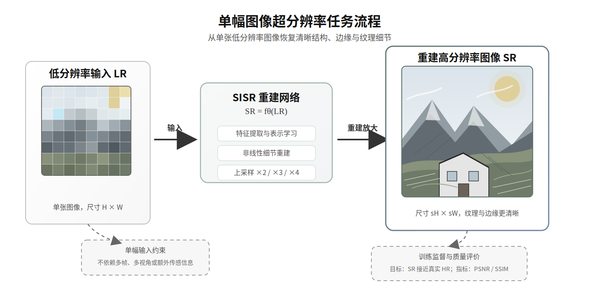
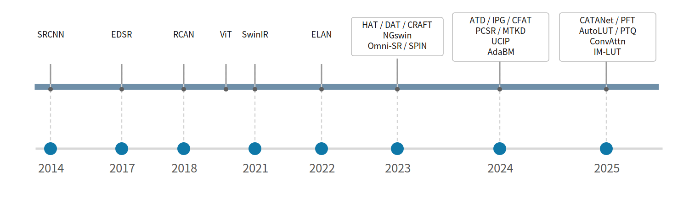
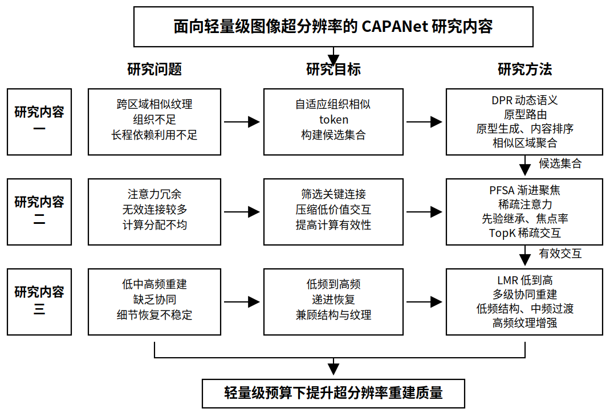
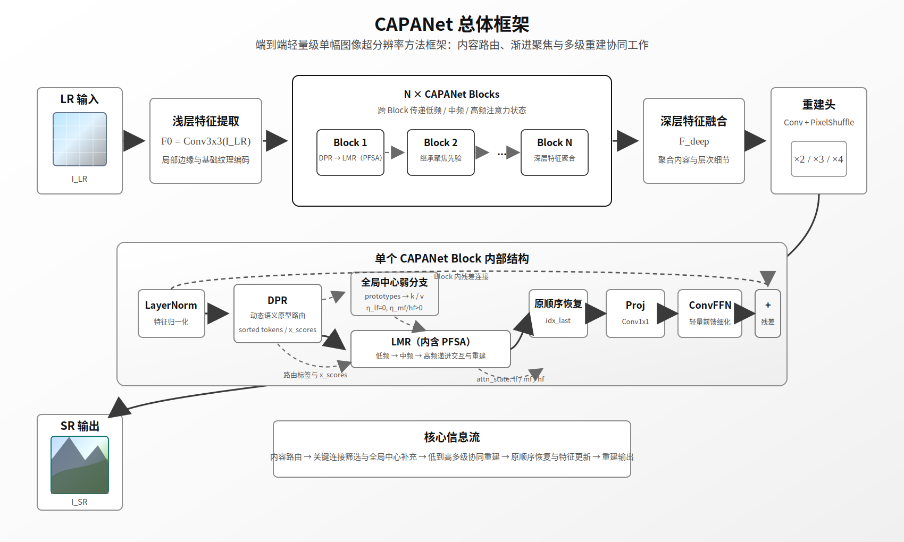
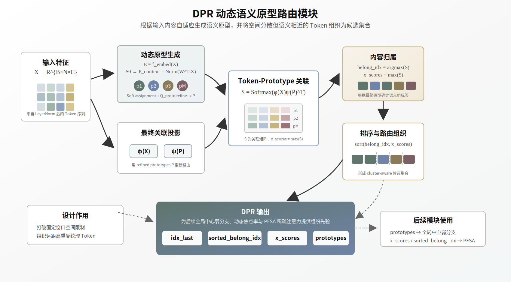
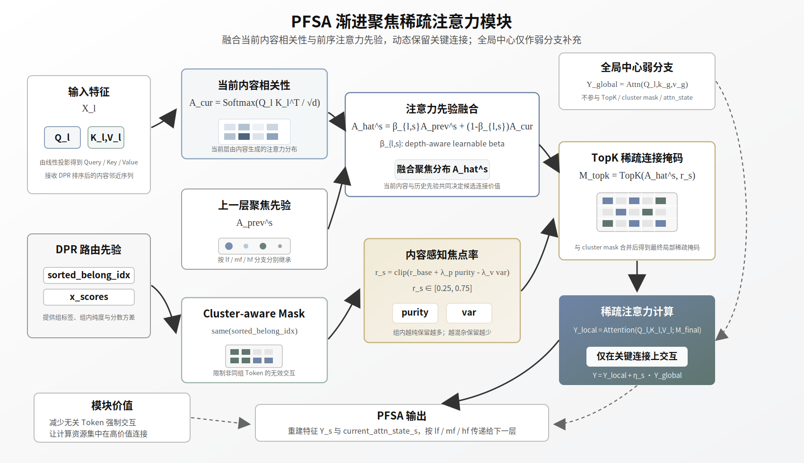
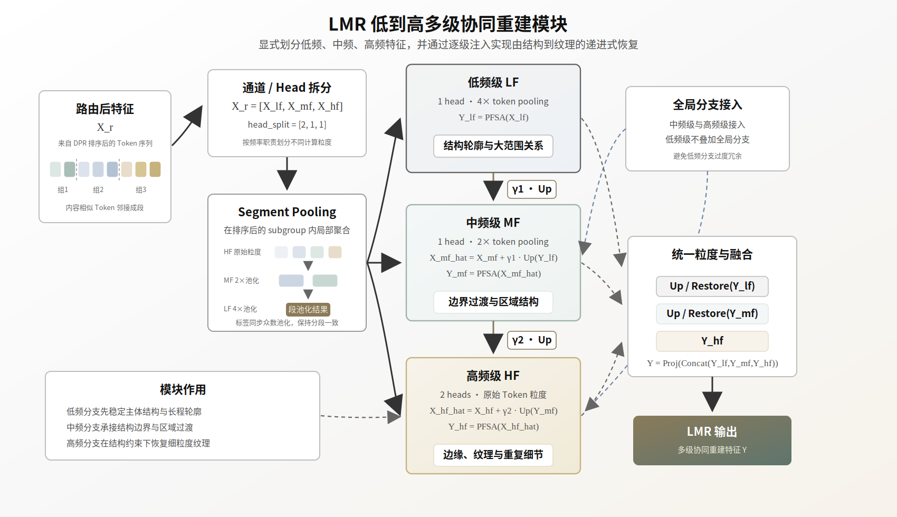

# 学位论文开题报告

## 开题报告登记表

| 项目             | 内容                                                                                                           |
| ------------------ | ---------------------------------------------------------------------------------------------------------------- |
| 学号             |                                                                                                                |
| 姓名             |                                                                                                                |
| 学院             |                                                                                                                |
| 学科（专业）     |                                                                                                                |
| 研究方向         | 轻量级图像超分辨率                                                                                             |
| 导师姓名         |                                                                                                                |
| 攻读学位         |                                                                                                                |
| 论文题目（中文） | 面向轻量级图像超分辨率的内容自适应聚合与渐进聚焦注意力网络                                                     |
| 论文题目（英文） | CAPANet: Content-Adaptive Aggregation and Progressive Attention Network for Lightweight Image Super-Resolution |
| 选题来源         | 自拟选题                                                                                                       |
| 论文类型         | 基础研究                                                                                                       |
| 论文是否涉密     | 否                                                                                                             |
| 开题日期         |                                                                                                                |
| 开题地点         |                                                                                                                |

## 一、选题依据

> 包括选题的来源、研究背景与意义、国内外研究现状，以及主要参考文献目录。

### 1. 选题来源

本课题是在前期文献调研与实验探索基础上形成的自拟选题。选题面向轻量级图像超分辨率的实际需求，针对现有方法在长程依赖建模、注意力计算效率和层次化细节恢复方面的不足开展研究。

### 2. 研究背景与意义

在许多视觉应用中，图像质量问题往往不是发生在算法处理的最后一步，而是贯穿于采集、传输、存储和显示的整个链路之中。移动终端拍摄远处目标时，受限于传感器尺寸、镜头条件和抖动噪声，图像中的文字、边缘和细小纹理容易变得模糊；视频监控或车载视觉系统为了降低带宽和存储成本，常常需要对图像或视频进行压缩传输，细节信息会在压缩和下采样过程中被削弱；遥感成像、医学影像和历史图像修复等场景中，也经常面临采集成本高、原始分辨率不足或无法重新采集的问题。对于这些场景而言，低分辨率并不只是“看起来不够清楚”，还意味着边缘位置、纹理走向和结构关系等关键信息被弱化，进而影响后续检测、识别、测量和分析任务的可靠性。

从工程应用角度看，提升图像分辨率并不总能依赖更昂贵的采集设备或更高码率的传输方式。更高分辨率的传感器会带来硬件成本、功耗和数据吞吐压力的增加；更高带宽的传输会提高通信成本，也不适合移动端、边缘设备和低带宽环境；对于已经采集完成的老旧图像、监控图像和历史影像，更无法通过重新拍摄来弥补细节缺失。因此，如何在已有低分辨率图像基础上尽可能恢复清晰结构和纹理细节，成为图像增强与智能视觉系统中的一个现实需求。单幅图像超分辨率（Single Image Super-Resolution, SISR）正是在这一背景下受到广泛关注。其目标是从单张低分辨率图像中重建高分辨率结果，在不显著增加采集、存储和传输成本的前提下提升图像质量，如图 1 所示。

  

图 1 单幅图像超分辨率任务示意图

近年来，深度学习显著推动了超分辨率重建质量的提升，但真实应用中的矛盾并没有因此消失。一方面，高性能超分辨率模型往往依赖更深的网络、更大的通道数、更复杂的注意力机制或更大范围的非局部交互，虽然能够获得较好的指标表现，却伴随参数量大、计算量高和推理时延长等问题。对于移动摄影、实时视频增强和边缘视觉系统而言，模型不能只在离线环境中“重建得好”，还必须在有限算力、有限内存和低功耗条件下稳定运行。另一方面，简单压缩模型规模又会带来新的问题：固定窗口或规则分块难以捕获远距离重复纹理，稠密注意力会把大量无关 token 也纳入计算，单尺度特征交互又容易把整体结构、边缘过渡和高频纹理混在一起处理。结果是模型虽然变轻了，但在建筑线条、文字边缘、漫画细线和重复纹理等复杂场景中，仍容易出现结构断裂、纹理伪影和细节恢复不稳定等现象。

因此，轻量级图像超分辨率的关键不只是“把模型做小”，而是在有限计算预算下让模型把算力用在真正有价值的信息上。具体而言，模型需要知道哪些位置虽然空间距离较远但内容相似，哪些注意力连接对重建最有帮助，以及整体结构和高频细节应当如何分层恢复。这使得轻量级超分辨率研究从单纯压缩参数量，逐渐转向内容自适应组织、关键连接筛选和层次化重建机制的联合设计。

基于上述背景，本课题拟提出面向轻量级图像超分辨率的内容自适应聚合与渐进聚焦注意力网络 CAPANet，围绕内容组织、关键连接筛选和低到高递进重建三条主线展开研究。该方法试图回答一个更具体的问题：在移动端和边缘设备可以承受的复杂度范围内，如何更有效地利用跨区域相似纹理，减少无效注意力计算，并让结构信息逐步引导细节恢复。课题研究的意义体现在两个方面：在理论层面，可为轻量级超分辨率中的内容自适应建模、稀疏注意力和层次化重建提供新的方法参考；在应用层面，可为移动端图像增强、视频监控画质提升、边缘设备图像恢复和低带宽图像传输后处理等场景提供更具部署潜力的技术方案。

### 3. 国内外研究现状

单幅图像超分辨率是低层视觉领域中的经典问题，其核心目标是从低分辨率图像中恢复具有清晰结构和丰富纹理的高分辨率图像。近年来，CVPR、ICCV、ECCV 等计算机视觉顶级会议围绕高效 Transformer、内容自适应聚合、动态稀疏注意力和端侧部署等方向持续推出新方法，使超分辨率研究从单纯追求重建精度，逐步转向兼顾重建质量、长程依赖建模、推理效率和轻量化部署的综合设计。这一趋势与本文面向轻量级图像超分辨率的内容自适应聚合与渐进聚焦注意力网络研究具有直接关联，其技术发展脉络如图 2 所示。

  

图 2 轻量级图像超分辨率技术发展脉络图

#### 3.1 从深度卷积到 Transformer 的超分辨率基础方法

早期单幅图像超分辨率研究主要依赖人工先验、字典学习和稀疏表示。深度学习兴起后，Dong 等人[1]提出 SRCNN，首次将低分辨率到高分辨率的映射统一为端到端卷积网络学习问题。随后，Lim 等人[2]提出 EDSR，通过去除冗余归一化模块并扩大残差网络容量提升重建精度；Zhang 等人[3]提出 RCAN，在残差中残差结构中引入通道注意力，使网络能够更加关注高频细节。上述经典工作奠定了深度超分辨率的基本范式，但它们主要依赖局部卷积堆叠和网络深度提升来增强表达能力，模型规模和计算量也随之增加。

Transformer 最早由 Vaswani 等人[4]在自然语言处理领域提出，其核心思想是以自注意力机制取代循环结构和卷积结构，通过多头注意力在不同表示子空间中建模元素之间的全局依赖关系。与传统循环网络相比，Transformer 具有更好的并行计算能力；与局部卷积相比，自注意力能够直接建立远距离位置之间的关联。随后，Dosovitskiy 等人[5]提出 Vision Transformer（ViT），将二维图像划分为固定大小的 patch 序列，并直接输入标准 Transformer 进行图像识别，证明纯 Transformer 架构在大规模预训练和迁移学习条件下能够有效处理视觉任务。ViT 的提出使 Transformer 从自然语言处理扩展为视觉骨干网络，也为后续 Swin Transformer、SwinIR 等图像恢复模型提供了重要基础。

在图像超分辨率任务中，Transformer 的引入进一步推动模型从局部卷积增强走向显式长程依赖建模。Liang 等人[6]提出 SwinIR，将 shifted-window 机制系统用于图像恢复任务，证明了窗口化自注意力在超分辨率中的有效性和通用性。Zhang 等人[7]提出 ELAN，通过 shift-conv 与 group-wise multi-scale self-attention 兼顾局部结构提取和多尺度长程交互。2023 年，Xiangyu Chen 等人[8]提出 HAT，指出现有 SR Transformer 对输入空间范围的利用仍然有限，并通过通道注意力、窗口自注意力和重叠交叉注意力增强跨窗口信息交互。Zheng Chen 等人[9]提出 DAT，在空间维度和通道维度之间交替聚合特征，以提升 Transformer 对全局上下文和局部结构的联合表达能力。Li 等人[10]提出 CRAFT，进一步指出 Transformer 更擅长低频建模而对高频表示构造能力有限，因此引入高频增强残差块与特征调制机制来补充纹理细节。这些方法在性能上取得明显提升，但固定窗口、规则分块和密集注意力计算仍会带来较高计算开销，也限制了其在资源受限设备上的部署。

#### 3.2 轻量级图像超分辨率研究现状

随着移动端图像增强、实时显示和边缘智能应用快速发展，轻量级超分辨率逐渐成为 2023～2025 年国内图像处理研究中的重要方向。国内综述文献也对这一趋势进行了系统总结。朱新峰和宋健[11]将轻量级图像超分辨率方法概括为传统卷积方法和注意力机制方法，指出高频细节恢复不足与部署效率约束之间的矛盾是该方向的关键问题。于会昌和刘士远[12]从网络结构、上采样方式、损失函数和应用场景等方面总结了深度学习图像超分辨率的关键技术与前沿进展。毕修平等人[13]提出蓝图可分离卷积 Transformer 网络，将高效卷积与轻量 Transformer 协同起来，以较低参数量和计算量获得较好的重建效果。刘紫阳等人[14]提出自适应特征融合的循环网络，通过递归特征提取与多层特征融合增强纹理恢复能力。

在具体模型设计方面，国内研究近年也从单纯减少参数量，逐步转向全局-局部信息融合、跨尺度注意力建模和轻量化特征蒸馏。吕鑫栋等人[15]提出基于改进 Transformer 的结构化图像超分辨网络，利用自注意力挖掘大范围全局信息，并通过空间注意力单元提取结构化映射关系。陈豪等人[16]提出基于 Transformer-CNN 的轻量级图像超分辨率重建网络，通过混合模块增强局部-全局特征捕获能力，使模型更适合移动端和嵌入式场景。赵瑶谦等人[17]提出自注意力特征蒸馏方法，在降低复杂度的同时提取深层图像特征。宋霄罡等人[18]提出多尺度大核注意力特征融合网络，通过多尺度大核可分离卷积兼顾局部感知与长距离建模。胡明志等人[19]面向遥感图像设计 CNN 与 Transformer 聚合网络，使用注意力聚合模块融合 CNN 的高频细节提取能力和 Transformer 的全局建模能力。刘子涵等人[20]提出基于全局依赖 Transformer 的图像超分辨率网络，利用轴向窗口和自注意力建立更充分的全局依赖关系。李焱等人[21]提出融合通道注意力的跨尺度 Transformer 图像超分辨率重建方法，通过跨尺度交互与通道注意力协同提升多尺度特征表达能力。这些 2023～2025 年中文文献表明，国内研究正在从模型压缩转向面向部署约束、内容组织、跨尺度交互和高频细节恢复的结构重构。

2023 年的三大顶会研究已经开始围绕轻量级 Transformer 的窗口交互、多维聚合和内容区域组织展开。Choi 等人[22]在 CVPR 2023 提出 NGswin，将 N-Gram 上下文引入 Swin Transformer，使相邻窗口之间通过滑动窗口自注意力进行交互，在保持高效结构的同时扩大恢复像素可利用的上下文范围。Wang 等人[23]在 CVPR 2023 提出 Omni-SR，针对轻量级 ViT 中单一维度自注意力和同质化聚合的问题，构建从空间到通道的全维聚合机制，以增强轻量模型的有效感受野。Zhang 等人[24]在 ICCV 2023 提出 SPIN，通过超像素将局部相似像素聚合为可解释区域，再进行超像素内注意力与超像素交叉注意力交互，避免规则 patch 划分带来的非相似结构干扰。这些工作说明，轻量级超分辨率不再只依赖减少层数或通道数，而是开始通过更合理的上下文组织方式提升单位计算量的有效性。

在 2024 年和 2025 年的三大顶会中，轻量级与部署友好超分辨率进一步从参数压缩扩展到自适应计算、蒸馏、量化和查表推理等方向。Jeong 等人[25]在 ECCV 2024 提出 PCSR，通过像素级分类器为不同恢复难度的像素分配不同容量的上采样器，实现性能与计算量的动态平衡。Jiang 等人[26]在 ECCV 2024 提出 MTKD，利用多教师知识蒸馏指导紧凑学生网络训练。Li 等人[27]在 ECCV 2024 提出 UCIP，通过动态 prompt 构建通用压缩图像超分辨率框架。Hong 和 Lee[28]在 CVPR 2024 提出 AdaBM，通过自适应 bit mapping 实现超分辨率模型的快速量化。Xu 等人[29]在 CVPR 2025 提出 AutoLUT，利用自动采样和自适应残差学习增强 LUT 型超分辨率网络。Wang 等人[30]在 ICCV 2025 提出面向超分辨率的异常值感知后训练量化方法，在无需大规模重训练的条件下降低推理成本。Lee 等人[31]在 ICCV 2025 提出 ConvAttn，用卷积模拟自注意力的长程建模能力，以降低 Transformer 的计算负担。Park 等人[32]在 ICCV 2025 提出 IM-LUT，通过插值混合查找表支持高效任意尺度超分辨率。这一阶段的研究表明，轻量级超分辨率已经从网络结构轻量化发展到更细粒度的内容自适应计算和端侧推理优化。

#### 3.3 Transformer 与内容自适应高效建模研究现状

近三年三大顶会中的另一个重要趋势，是从固定窗口注意力转向内容自适应组织和动态稀疏交互。2023 年的 SPIN[24]已经表明，按照内容相似性而非规则网格组织 token，有助于减少非相似区域之间的无效注意力干扰。随后，Zhang 等人[33]在 CVPR 2024 提出 ATD，通过 adaptive token dictionary 将可学习先验引入测试阶段的自适应细化过程，使模型能够在局部窗口之外利用更远距离但语义相似的 token。Tian 等人[34]在 CVPR 2024 提出 IPG，借助图结构和可变节点度打破固定邻域的刚性限制，使高频细节区域获得更多聚合预算。Ray 等人[35]在 CVPR 2024 提出 CFAT，将三角窗口和矩形窗口结合，增强窗口注意力对边界和多尺度长程特征的建模能力。Liu 等人[36]在 CVPR 2025 提出 CATANet，面向轻量级场景设计 content-aware token aggregation，将内容相似 token 先聚合再交互，以提高长程信息利用效率。Long 等人[37]在 CVPR 2025 提出 PFT，通过 progressive focused attention 逐层继承注意力先验，先过滤低价值连接再进行重点计算。上述研究与本文拟研究的内容自适应聚合和渐进聚焦稀疏注意力具有较强关联，表明最新超分辨率研究正在从“扩大注意力范围”转向“按内容组织 token 并按重要性分配计算资源”。

综合国内外研究现状，当前仍存在以下不足。

1. 轻量级卷积与窗口化 Transformer 方法虽然有效降低了复杂度，但多数仍以固定局部邻域、规则窗口或预设结构为主，对跨区域重复纹理和远距离自相似信息的直接建模仍不充分。
2. 内容感知分组、字典先验或图结构方法提高了相似信息利用率，但部分方法仍依赖静态原型、离线先验或固定分组规则，对测试图像中新颖纹理分布的自适应能力有限。
3. 现有稀疏注意力和高效交互方法更多聚焦于减少连接数量或压缩计算开销，尚未充分将连接筛选机制与超分辨率中由结构恢复到纹理补偿的层次化重建规律统一起来。

主要参考文献：

[1] Dong C, Loy C C, He K, et al. Learning a deep convolutional network for image super-resolution[C]//European Conference on Computer Vision. Cham: Springer, 2014:184-199.
[2] Lim B, Son S, Kim H, et al. Enhanced deep residual networks for single image super-resolution[C]//Proceedings of the IEEE Conference on Computer Vision and Pattern Recognition Workshops. 2017:136-144.
[3] Zhang Y, Li K, Li K, et al. Image super-resolution using very deep residual channel attention networks[C]//European Conference on Computer Vision. Cham: Springer, 2018:294-310.
[4] Vaswani A, Shazeer N, Parmar N, et al. Attention is all you need[C]//Advances in Neural Information Processing Systems. 2017.
[5] Dosovitskiy A, Beyer L, Kolesnikov A, et al. An image is worth 16x16 words: Transformers for image recognition at scale[C]//International Conference on Learning Representations. 2021.
[6] Liang J, Cao J, Sun G, et al. SwinIR: image restoration using Swin Transformer[C]//Proceedings of the IEEE/CVF International Conference on Computer Vision Workshops. 2021:1833-1844.
[7] Zhang X, Zeng H, Guo S, et al. Efficient long-range attention network for image super-resolution[C]//European Conference on Computer Vision. Cham: Springer, 2022:649-667. DOI:10.1007/978-3-031-19790-1_39.
[8] Chen X, Wang X, Zhou J, et al. Activating more pixels in image super-resolution Transformer[C]//Proceedings of the IEEE/CVF Conference on Computer Vision and Pattern Recognition. 2023:22367-22377.
[9] Chen Z, Zhang Y, Gu J, et al. Dual aggregation Transformer for image super-resolution[C]//Proceedings of the IEEE/CVF International Conference on Computer Vision. 2023:12312-12321.
[10] Li A, Zhang L, Liu Y, et al. Feature modulation Transformer: cross-refinement of global representation via high-frequency prior for image super-resolution[C]//Proceedings of the IEEE/CVF International Conference on Computer Vision. 2023:12514-12524.
[11] 朱新峰, 宋健. 轻量级图像超分辨率研究综述[J]. 计算机工程与应用, 2024, 60(16):49-60. DOI:10.3778/j.issn.1002-8331.2403-0230.
[12] 于会昌, 刘士远. 深度学习图像超分辨率重建:关键技术解析与前沿进展[J]. 软件导刊, 2025, 24(02):211-220. DOI:10.11907/rjdk.241101.
[13] 毕修平, 陈实, 张乐飞. 轻量级图像超分辨率的蓝图可分离卷积Transformer网络[J]. 中国图象图形学报, 2024, 29(04):875-889. DOI:10.11834/jig.230225.
[14] 刘紫阳, 杨勇, 黄淑英, 等. 基于自适应特征融合的超分辨率重建循环网络[J/OL]. 中国图象图形学报, 2025:1-18. DOI:10.11834/jig.250332.
[15] 吕鑫栋, 李娇, 邓真楠, 等. 基于改进Transformer的结构化图像超分辨网络[J]. 浙江大学学报(工学版), 2023, 57(5):865-874,910. DOI:10.3785/j.issn.1008-973X.2023.05.002.
[16] 陈豪, 夏振平, 程成, 林李兴, 张博文. 基于Transformer-CNN的轻量级图像超分辨率重建网络[J]. 计算机应用, 2024, 44(1):292-299.
[17] 赵瑶谦, 滕奇志, 何小海, 等. 基于自注意力特征蒸馏的轻量级图像超分辨率重建[J]. 计算机工程, 2025, 51(5):257-265. DOI:10.19678/j.issn.1000-3428.0069822.
[18] 宋霄罡, 张鹏飞, 刘万波, 等. 多尺度大核注意力特征融合网络的图像超分辨率重建[J]. 中国图象图形学报, 2025, 30(04):1084-1099. DOI:10.11834/jig.240042.
[19] 胡明志, 孙俊, 杨彪, 等. 基于CNN和Transformer聚合的遥感图像超分辨率重建[J]. 浙江大学学报(工学版), 2025, 59(5):938-946.
[20] 刘子涵, 周登文, 刘玉铠. 基于全局依赖Transformer的图像超分辨率网络[J]. 计算机应用, 2024, 44(5):1588-1596. DOI:10.11772/j.issn.1001-9081.2023050636.
[21] 李焱, 董仕豪, 张家伟, 等. 融合通道注意力的跨尺度Transformer图像超分辨率重建[J]. 中国图象图形学报, 2025, 30(03):784-797. DOI:10.11834/jig.240279.
[22] Choi H, Lee J, Yang J. N-Gram in Swin Transformers for efficient lightweight image super-resolution[C]//Proceedings of the IEEE/CVF Conference on Computer Vision and Pattern Recognition. 2023:2071-2081.
[23] Wang H, Chen X, Ni B, et al. Omni aggregation networks for lightweight image super-resolution[C]//Proceedings of the IEEE/CVF Conference on Computer Vision and Pattern Recognition. 2023:22378-22387.
[24] Zhang A, Ren W, Liu Y, et al. Lightweight image super-resolution with superpixel token interaction[C]//Proceedings of the IEEE/CVF International Conference on Computer Vision. 2023:12728-12737.
[25] Jeong J, Kim J, Jo Y, et al. Accelerating image super-resolution networks with pixel-level classification[C]//European Conference on Computer Vision. Cham: Springer, 2024:236-251. DOI:10.1007/978-3-031-72646-0_14.
[26] Jiang Y, Feng C, Zhang F, et al. MTKD: multi-teacher knowledge distillation for image super-resolution[C]//European Conference on Computer Vision. Cham: Springer, 2024:364-382. DOI:10.1007/978-3-031-72933-1_21.
[27] Li X, Li B, Jin Y, et al. UCIP: a universal framework for compressed image super-resolution using dynamic prompt[C]//European Conference on Computer Vision. Cham: Springer, 2024:107-125.
[28] Hong C, Lee K M. AdaBM: on-the-fly adaptive bit mapping for image super-resolution[C]//Proceedings of the IEEE/CVF Conference on Computer Vision and Pattern Recognition. 2024:2641-2650.
[29] Xu Y, Yang S, Liu X, et al. AutoLUT: LUT-based image super-resolution with automatic sampling and adaptive residual learning[C]//Proceedings of the IEEE/CVF Conference on Computer Vision and Pattern Recognition. 2025:23131-23140.
[30] Wang H, Lu J, Zhang Y, et al. Outlier-aware post-training quantization for image super-resolution[C]//Proceedings of the IEEE/CVF International Conference on Computer Vision. 2025:16175-16184.
[31] Lee D, Yun S, Ro Y. Emulating self-attention with convolution for efficient image super-resolution[C]//Proceedings of the IEEE/CVF International Conference on Computer Vision. 2025:24467-24477.
[32] Park S, Lee S, Jin K H, et al. IM-LUT: interpolation mixing look-up tables for image super-resolution[C]//Proceedings of the IEEE/CVF International Conference on Computer Vision. 2025:14317-14325.
[33] Zhang L, Li Y, Zhou X, et al. Transcending the limit of local window: advanced super-resolution Transformer with adaptive token dictionary[C]//Proceedings of the IEEE/CVF Conference on Computer Vision and Pattern Recognition. 2024:2856-2865.
[34] Tian Y, Chen H, Xu C, et al. Image processing GNN: breaking rigidity in super-resolution[C]//Proceedings of the IEEE/CVF Conference on Computer Vision and Pattern Recognition. 2024:24108-24117.
[35] Ray A, Kumar G, Kolekar M H. CFAT: unleashing triangular windows for image super-resolution[C]//Proceedings of the IEEE/CVF Conference on Computer Vision and Pattern Recognition. 2024:26120-26129.
[36] Liu X, Liu J, Tang J, et al. CATANet: efficient content-aware token aggregation for lightweight image super-resolution[C]//Proceedings of the IEEE/CVF Conference on Computer Vision and Pattern Recognition. 2025:17902-17912.
[37] Long W, Zhou X, Zhang L, et al. Progressive focused Transformer for single image super-resolution[C]//Proceedings of the IEEE/CVF Conference on Computer Vision and Pattern Recognition. 2025:2279-2288.

## 二、研究内容和目标

> 说明选题的具体研究内容、研究目标，以及拟解决的关键问题。

### 1. 研究目标

尽管近年来图像超分辨率技术取得了显著进展，但在实际应用中仍面临若干亟待解决的问题。首先，低分辨率图像中往往同时包含复杂边缘、重复纹理和跨区域相似结构，现有轻量级模型在复杂场景下仍容易出现细节恢复不足、纹理重建失真和结构连续性不稳定等问题。其次，随着移动摄影、视频增强和边缘视觉应用的发展，超分辨率任务对推理速度提出了更高要求，如何在保证重建质量的同时实现低时延处理，仍是一项重要挑战。此外，实际应用中的超分辨率模型通常需要部署在移动终端、边缘设备或嵌入式平台上，而这类设备的算力、存储和功耗预算有限，计算复杂度较高的模型难以直接落地应用。因此，研究兼顾重建精度、运行效率和部署友好性的轻量级超分辨率方法，具有明确的现实意义。

针对上述问题，本文旨在设计并实现一种面向轻量级单幅图像超分辨率任务的内容自适应聚合与渐进聚焦注意力网络 CAPANet，在有限参数量与计算预算下提升复杂结构、重复纹理和高频边缘的恢复能力，减少无效注意力计算带来的冗余开销，并增强模型在移动端与边缘设备上的部署适应性，从而为图像增强、视觉显示和后续检测识别等任务提供更高质量的输入。

### 2. 研究内容

通过对国内外研究现状的分析可以看出，轻量级图像超分辨率研究已经从单纯压缩参数量，逐步发展到内容自适应建模、稀疏注意力计算和部署友好型推理优化等方向。但现有方法在跨区域相似纹理组织、注意力连接筛选和由结构到纹理的层次化重建方面仍存在不足。基于上述问题，本文拟围绕内容自适应聚合与渐进聚焦注意力网络 CAPANet 开展以下几方面研究工作，如图 3 所示。

  

图 3 CAPANet 研究内容框架图

1. 针对现有轻量级超分辨率模型多依赖固定窗口、规则分块或静态聚类方式，难以根据输入图像内容有效组织跨区域相似纹理和长程依赖信息的问题，拟提出动态语义原型路由模块 DPR，研究基于图像内容自适应生成语义原型、建立 token 与原型之间的关联关系，并完成内容排序、相似区域聚合和候选集合构建的方法，以期达到在轻量级计算预算下提升远距离相似信息利用率和非局部交互针对性的目标。
2. 针对现有 Transformer 超分辨率方法中注意力连接数量较多、无效交互占比偏高以及计算资源分配不均的问题，拟提出渐进聚焦稀疏注意力模块 PFSA，研究结合当前层内容相似性与前序层注意力先验的动态稀疏连接构建方法，并探索面向不同内容组的自适应焦点率调节机制，以期达到减少冗余注意力计算、保留关键依赖关系并提高注意力计算有效利用率的目标。
3. 针对现有轻量级方法在整体结构恢复、边缘过渡和高频纹理补偿之间缺少明确分工，导致复杂场景下结构连续性和细节真实性难以兼顾的问题，拟提出低到高多级协同重建模块 LMR，研究低频、中频和高频特征的显式划分、逐级注入与协同重建机制，以期达到在保持主体结构稳定的同时增强细粒度纹理和复杂边缘恢复能力的目标。

上述三个研究内容之间不是简单并列关系，而是按照轻量级超分辨率重建过程中的信息流动逐级展开。DPR 位于方法链路的前端，主要解决“如何组织信息”的问题，将空间上分散但内容相近的 token 聚合为更合理的候选交互集合，为后续注意力计算提供内容基础；PFSA 建立在 DPR 的路由结果之上，主要解决“如何选择连接”的问题，通过渐进注意力先验和动态焦点率从候选集合中筛选关键依赖，减少无效交互并提高有限计算资源的利用率；LMR 则进一步利用 PFSA 得到的有效交互结果，解决“如何完成重建”的问题，将低频结构、中频过渡和高频纹理恢复组织为由粗到细的递进式重建过程。因此，三者形成“内容路由—关键连接筛选—多级协同重建”的递进关系：DPR 提供有效候选，PFSA 提高交互效率，LMR 将筛选后的结构与纹理信息转化为最终重建能力，共同服务于在轻量级预算下提升超分辨率重建质量这一总体目标。

### 3. 拟解决的关键问题

(1) 现有轻量级超分辨率模型对跨区域相似纹理和长程依赖的利用仍然不足，在复杂结构与重复纹理场景下容易出现信息组织不充分的问题。本文拟在 CATANet 内容感知聚合思路的基础上，通过动态语义原型路由机制提升远距离相似信息的组织与交互能力。

(2) 现有注意力机制普遍存在无效连接较多、计算资源分配不均以及稀疏交互针对性不足的问题，难以在有限计算预算下兼顾效率与效果。本文拟通过渐进聚焦稀疏注意力机制，对连接关系进行内容感知筛选，并自适应调节不同内容组的保留连接比例。

(3) 现有轻量级方法在结构连续性与高频纹理恢复之间往往缺少合理分工，重建过程层次性不足，难以在复杂场景下保持稳定的细节恢复质量。本文拟通过低到高多级协同重建机制，建立由低频结构到高频纹理的递进式重建链路。

## 三、选题研究方案及可行性分析

> 包括研究方法、实验环境及可行性分析等。

### 3.1 研究方法

本文围绕轻量级单幅图像超分辨率任务展开研究，拟提出一种内容自适应聚合与渐进聚焦注意力网络 CAPANet。该模型的核心目标是在参数量、计算量和推理速度受限的条件下，提升模型对复杂边缘、重复纹理和跨区域相似结构的恢复能力。CAPANet 的总体结构如图 4 所示。

  

图 4 CAPANet 总体结构图

具体而言，给定低分辨率输入图像 $I_{LR}$，网络首先通过浅层卷积提取初始特征 $F_0$，随后输入多个 CAPANet Block 进行深层特征建模，最后由重建头输出超分辨率图像 $I_{SR}$。整体流程可表示为：

$$
I_{LR} \rightarrow F_0 \rightarrow \text{CAPANet Blocks} \rightarrow F_{deep} \rightarrow \text{Reconstruction Head} \rightarrow I_{SR}

$$

其中，CAPANet Block 是本文方法的核心单元，主要由动态语义原型路由模块 DPR、渐进聚焦稀疏注意力模块 PFSA、低到高多级协同重建模块 LMR 以及轻量级前馈细化结构组成。一个 Block 内部首先对输入特征进行归一化处理，再通过 DPR 进行内容路由并生成动态语义原型；随后在 LMR 的低频、中频和高频三个层级中调用 PFSA 完成关键连接筛选和特征交互，其中由 DPR prototypes 生成的全局中心弱分支仅作为中高频 PFSA 输出处的原型级补充，不参与 TopK 掩码和注意力状态递推；最后通过投影层、残差连接和前馈网络完成特征更新。为了使注意力聚焦信息在网络深层逐步稳定，本文将在相邻 Block 之间传递低频、中频和高频三级注意力状态，使结构先验和纹理先验能够在后续特征建模中持续修正。

#### 3.1.1 研究方法一：动态语义原型路由

针对现有轻量级超分辨率模型多依赖固定窗口或规则分块，难以根据输入内容有效组织跨区域相似纹理的问题，本文设计动态语义原型路由模块 DPR，如图 5 所示。传统窗口注意力通常按照空间位置划分 token，但在建筑窗格、漫画线条、文字边缘和重复纹理等场景中，真正具有参考价值的相似结构往往分散在图像不同区域。如果模型只在固定邻域内建立交互关系，就容易造成远距离自相似信息利用不足，从而出现纹理恢复不连续、边缘结构断裂或重复模式不稳定等问题。

  

图 5 DPR 模块结构示意图

DPR 的核心思想是从“空间邻近组织”转向“内容相似组织”。设当前输入 token 序列为 $X \in \mathbb{R}^{B \times N \times C}$，其中 $B$ 表示批大小，$N$ 表示 token 数量，$C$ 表示通道维度。DPR 首先根据当前图像内容生成一组动态语义原型 $P \in \mathbb{R}^{B \times M \times C}$，每个原型可以理解为当前图像中的一种纹理中心、边缘中心或结构中心。与直接使用固定可学习原型不同，本文拟采用“软分配内容聚合、原型槽位约束、反向路由确认”的方式生成动态原型，使原型既来源于当前输入图像，又具有相对稳定的多中心分工。

在具体实现上，DPR 先由 token 特征预测其到不同原型的软分配权重，并通过加权聚合得到内容原型；随后引入可学习 prototype query 作为稳定槽位，对内容原型进行轻量细化；最后再利用细化后的动态原型反向计算 token 归属关系。token 与原型之间的关联概率可表示为：

$$
S = \text{Softmax}\left(\frac{\phi(X)\psi(P)^{\mathsf{T}}}{\sqrt{d}},\ \text{dim}=M\right)

$$

其中，$\phi(\cdot)$ 和 $\psi(\cdot)$ 分别表示 token 特征与原型特征的映射函数，$d$ 为映射后的特征维度，$\psi(P)^{\mathsf{T}}$ 表示在最后两个维度上转置，Softmax 沿原型维度 $M$ 进行归一化。依据关联概率 $S$，DPR 将每个 token 分配到最相关的语义原型，并进一步按照原型标签和归属置信度对 token 进行排序，使语义或纹理相似的 token 在序列中相邻。该模块不仅输出排序后的特征，还输出原始顺序恢复索引 `idx_last`、排序后的语义标签 `sorted_belong_idx`、归属置信度 `x_scores` 和动态原型 `prototypes`。其中，`idx_last` 用于后续恢复原始空间顺序，`sorted_belong_idx` 用于构造语义一致的注意力掩码，`x_scores` 用于计算组内置信度方差、标签池化平局规则和动态焦点率，`prototypes` 则为全局中心弱分支提供语义先验。

通过上述设计，DPR 能够将空间上分散但内容相近的 token 重新组织到相同或相邻候选集合中，为后续注意力计算提供更干净、更具语义一致性的候选范围。相比静态聚类或规则窗口划分，该模块能够随输入图像内容自适应调整分组关系，从而增强模型对新颖纹理、重复结构和非局部相似区域的适应能力。

#### 3.1.2 研究方法二：渐进聚焦稀疏注意力

在 DPR 完成内容路由后，候选集合内部仍然可能存在大量低价值连接。现有 Transformer 超分辨率方法通常在窗口或分组内执行稠密注意力计算，默认所有 token 两两交互。这种方式虽然能够增强特征表达，但也会将边界噪声、不相关纹理和弱相关区域一并纳入计算，造成计算冗余，并可能干扰高频细节恢复。为解决这一问题，本文设计渐进聚焦稀疏注意力模块 PFSA，如图 6 所示。

  

图 6 PFSA 模块结构示意图

PFSA 的核心思想是从“候选 token 全连接”转向“关键连接稀疏交互”。该模块在当前内容相似性计算的基础上，引入上一 Block 或上一阶段传递的注意力先验，使注意力不是每层从零开始重新计算，而是在已有聚焦结果上继续修正。设 $A_{l-1}^{s}$ 表示第 $l-1$ 个 Block 在尺度分支 $s$ 上传递的注意力先验，$A_{l,cur}^{s}$ 表示当前层由内容相似性得到的注意力分布，其中 $s \in \{lf,mf,hf\}$ 分别对应低频、中频和高频分支。若前序注意力状态为空，当前层直接使用 $A_{l,cur}^{s}$ 初始化；若由于 pooling 或 padding 导致 token 粒度发生变化，则需要先将 $A_{l-1}^{s}$ 对齐到当前尺度后再融合。融合后的聚焦分布可表示为：

$$
\bar{A}_{l-1}^{s} = \mathcal{R}_{s}(A_{l-1}^{s}), \quad
\hat{A}_l^{s} = \beta_{l,s} \bar{A}_{l-1}^{s} + (1-\beta_{l,s}) A_{l,cur}^{s}

$$

其中，$\mathcal{R}_{s}(\cdot)$ 表示将前序注意力状态对齐到当前尺度的操作，当状态为空时可直接令 $\bar{A}_{l-1}^{s}=A_{l,cur}^{s}$；$\beta_{l,s}$ 为与网络深度和尺度分支相关的注意力继承权重。低频结构相对稳定，可更多继承上一层注意力先验；中频边界既需要继承结构信息，也需要根据当前内容修正；高频细节变化较大，应保留更强的当前内容适应能力。因此，本文拟采用深度感知初始化与可学习参数相结合的方式设置 $\beta_{l,s}$，使浅层更依赖当前内容，深层逐步形成稳定聚焦。

在此基础上，PFSA 进一步引入内容感知焦点率，根据 DPR 输出的语义标签和归属置信度动态调整每个内容组的连接保留比例。其计算方式可表示为：

$$
r_{l,g}^{s} = \text{clip}(r_{base} + \lambda_p \cdot purity_{l,g}^{s} - \lambda_v \cdot var_{l,g}^{s},\ r_{min},\ r_{max})

$$

其中，$g$ 表示当前尺度分支内的内容组，$purity_{l,g}^{s}$ 表示该组在第 $l$ 个 Block 中的语义一致性，$var_{l,g}^{s}$ 表示组内归属置信度波动程度，$r_{min}$ 与 $r_{max}$ 分别为焦点率上下界。当组内 token 语义一致性较高时，模型保留更多有效连接以增强信息传播；当组内内容较为混杂或边界复杂时，模型自动压缩交互范围，以降低无关噪声扩散。最终，PFSA 根据融合注意力分布和动态焦点率生成 TopK 稀疏掩码，并结合 `sorted_belong_idx` 构造 cluster-aware mask，使同一语义原型内的 token 更容易建立连接，同时保留少量跨组高置信连接，以避免完全切断边界区域和重复纹理之间的信息流动。

此外，本文在 PFSA 的局部稀疏注意力之外设置独立的全局中心弱分支。该分支利用 DPR 输出的动态原型生成全局键和值，使 token 在局部稀疏交互之外，能够额外参考当前图像的语义中心。与直接将全局原型拼接到局部键值不同，该弱分支不参与 TopK 掩码、cluster-aware mask 和注意力状态递推，而是通过尺度相关门控进行残差式融合。具体而言，低频分支主要负责整体轮廓和长距离结构关系，原则上不额外叠加全局中心；中频分支少量引入全局中心以保持边界一致；高频分支更充分地利用全局中心，以参考全图重复纹理和细线条类型，减少局部细节漂移。

通过渐进聚焦、动态焦点率和全局中心补充，PFSA 能够在保留关键长程依赖的同时减少无效注意力连接，使有限计算资源集中到更重要的结构和纹理区域，从而兼顾重建质量与推理效率。

#### 3.1.3 研究方法三：低到高多级协同重建

尽管 DPR 和 PFSA 能够分别解决内容组织和连接筛选问题，但超分辨率重建本身并不是单纯的局部细节锐化过程，而是需要先恢复整体轮廓和主体结构，再逐步补足区域过渡、边缘变化和高频纹理。现有轻量级方法如果将所有 attention head 放在同一粒度上竞争式建模，容易出现结构不连续、边缘错位和纹理伪影等问题。为此，本文设计低到高多级协同重建模块 LMR，如图 7 所示。

  

图 7 LMR 模块结构示意图

LMR 的核心思想是从“单尺度混合重建”转向“低频到高频递进重建”。该模块接收 DPR 排序后的 token 序列，并按通道或注意力 head 拆分为高频、中频和低频三路分支。其中，高频分支保持原始 token 粒度，重点负责边缘、细线条、重复纹理和高频细节恢复；中频分支每 2 个相邻 token 执行一次基于 `x_scores` 的加权 segment pooling，用于建模结构边界、区域过渡和局部形状；低频分支每 4 个相邻 token 执行一次基于 `x_scores` 的加权 segment pooling，用于捕获整体轮廓、大范围结构和长距离关系。默认可采用 `heads(HF, MF, LF) = 2 / 1 / 1` 的分配方式，使高频分支承担主要细节恢复，中频和低频分支在更短序列上完成结构级交互。

为了保持 DPR 已经建立的内容邻接关系，LMR 中的 pooling 不直接按照原始空间位置执行，而是在排序后的语义相似 token 序列中进行 segment pooling。对于中频和低频分支，本文拟采用基于 `x_scores` 的加权平均聚合，使归属置信度更高的 token 在聚合过程中占据更大权重，从而让 pooled token 更稳定地代表当前 segment 的主体结构。同时，`sorted_belong_idx` 也需要同步进行标签池化，以保证中频和低频尺度仍然能够构造与语义标签一致的注意力掩码。

在完成三路特征构建后，LMR 按照低频到高频的顺序逐级注入信息。设三路特征分别为 $X^{lf}$、$X^{mf}$ 和 $X^{hf}$，则递进式建模过程可表示为：

$$
Y^{lf} = \text{PFSA}(X^{lf})

$$

$$
\hat{X}^{mf} = X^{mf} + \gamma_1 \cdot U_{lf \rightarrow mf}\left(\Pi_{lf \rightarrow mf}(Y^{lf})\right), \quad
Y^{mf} = \text{PFSA}(\hat{X}^{mf})

$$

$$
\hat{X}^{hf} = X^{hf} + \gamma_2 \cdot U_{mf \rightarrow hf}\left(\Pi_{mf \rightarrow hf}(Y^{mf})\right), \quad
Y^{hf} = \text{PFSA}(\hat{X}^{hf})

$$

其中，$\gamma_1$ 和 $\gamma_2$ 为可学习门控参数，用于控制低频到中频、中频到高频的信息注入强度；$U_{lf \rightarrow mf}(\cdot)$ 与 $U_{mf \rightarrow hf}(\cdot)$ 表示按照 segment pooling 分组关系进行的 token 粒度 repeat unpooling，并不是像素空间中的图像上采样；$\Pi_{lf \rightarrow mf}(\cdot)$ 与 $\Pi_{mf \rightarrow hf}(\cdot)$ 表示跨尺度通道投影，当相邻分支通道维度一致时可退化为恒等映射。这样既能够严格保持排序序列中的语义邻接关系，又能避免直接插值带来的额外假设，同时保证跨尺度相加时 token 长度和通道维度均匹配。该过程使低频结构信息先引导中频过渡建模，再由中频结果约束高频纹理恢复，从而形成“结构先行、边界过渡、细节增强”的重建路径。

完成三路建模后，LMR 将低频和中频输出逐级恢复到原始 token 粒度，并与高频输出进行拼接和投影融合：

$$
\tilde{Y}^{lf} = U_{mf \rightarrow hf}\left(U_{lf \rightarrow mf}(Y^{lf})\right), \quad
\tilde{Y}^{mf} = U_{mf \rightarrow hf}(Y^{mf})

$$

$$
Y = \text{Proj}(\text{Concat}(\tilde{Y}^{lf}, \tilde{Y}^{mf}, Y^{hf}))

$$

随后利用 DPR 输出的 `idx_last` 将结果恢复到原始空间顺序，并进入 Block 内的残差连接和前馈细化结构。通过这种方式，LMR 能够在不显著增加参数量的前提下，使低频结构、中频边界和高频纹理形成明确分工，提升模型对复杂结构和细粒度纹理的联合恢复能力。

综上所述，本文提出的 CAPANet 以 CAPANet Block 为基本单元，将 DPR、PFSA 和 LMR 组织为一条递进式技术链路。DPR 负责回答“哪些 token 应该被组织到一起”，为模型提供内容感知候选集合；PFSA 负责回答“候选 token 之间哪些连接值得保留”，使注意力计算集中到高价值依赖关系上；LMR 负责回答“低频结构、中频过渡和高频细节如何递进重建”，将有效交互转化为稳定的结构恢复和纹理补偿能力。三者协同作用，使模型能够在轻量级计算预算下更充分地利用跨区域相似纹理，减少无效注意力计算，并提高复杂场景中的结构连续性和细节恢复质量，为移动端和边缘设备场景下的高效图像超分辨率提供可行技术方案。

### 3.2 实验环境

1. 数据集

本文训练集采用 DIV2K 数据集。根据当前工程训练配置，×2、×3 和 ×4 三个倍率的训练均基于 DIV2K 的高分辨率图像及其对应的双三次退化低分辨率图像对开展，训练数据分别来自 `DIV2K_train_HR` 与 `DIV2K_train_LR_bicubic/X2`、`X3`、`X4`。DIV2K 是图像超分辨率任务中应用广泛的标准训练集，包含丰富的自然场景、边缘结构与纹理细节，能够为模型学习低分辨率到高分辨率的映射关系提供较好的数据基础。

在验证与测试方面，本文采用 Set5、Set14、BSD100、Urban100 和 Manga109 五个标准公开测试集。其中，Set5 和 Set14 图像数量较少，常用于基本重建性能评估；BSD100 覆盖较多自然图像，能够反映模型在一般场景下的稳健性；Urban100 包含大量重复纹理、规则线条和复杂几何结构，对长程依赖建模能力要求较高；Manga109 则包含大量高频边缘与细线条结构，适合评估模型对细节和纹理的恢复能力。上述测试集覆盖了平滑区域、复杂纹理、重复结构和几何轮廓等多类典型场景，能够较为全面地衡量模型的超分辨率重建效果。

2. 环境配置

本文实验在 Linux 环境下进行，采用 Python 3.9 与 PyTorch 2.x 深度学习框架，并结合 CUDA 进行训练与测试加速。模型训练、测试及复杂度分析均基于 NVIDIA RTX 4090 GPU 开展，其中推理延迟测试统一在单张 RTX 4090 上完成，以保证不同方法之间的比较具有一致性。

3. 训练设置

在训练设置方面，LR patch size 设为 64 × 64，batch size 设为 32，优化器采用 AdamW，betas = (0.9, 0.999)，weight_decay = 1e-4，初始学习率设为 5e-4，并采用 cosine decay 学习率衰减策略。主实验训练 500K iterations，消融实验统一训练 300K iterations；数据增强方式包括随机翻转、随机旋转和随机 RGB shuffle。默认结构配置采用 `heads(HF, MF, LF) = 2 / 1 / 1`、动态焦点率范围 [0.25, 0.75]，注意力继承权重采用 depth-aware 初始化与可学习参数结合的方式，其中低频、中频和高频分支分别初始化在约 [0.35, 0.75]、[0.25, 0.65] 和 [0.10, 0.50] 范围内；全局中心弱分支仅在中频与高频 PFSA 输出处保留，默认设置 $\eta_{lf}=0$、$\eta_{mf}>0$、$\eta_{hf}>0$。

4. 评估指标

模型性能主要从重建质量、复杂度和推理效率三个方面进行评估。重建质量指标采用 PSNR 和 SSIM，统一在 YCbCr 色彩空间的 Y 通道上计算；复杂度指标采用参数量（Params）与 FLOPs；推理效率采用 Latency 进行评估，延迟测试输入尺寸统一为 3 × 256 × 256。通过上述指标，可以较为全面地衡量 CAPANet 在精度、效率与部署友好性方面的综合表现。

其中，对于大小为 $H \times W$ 的重建图像 $I$ 与真实图像 $K$，均方误差（MSE）定义为：

$$
\mathrm{MSE} = \frac{1}{HW} \sum_{i=1}^{H} \sum_{j=1}^{W} \left( I(i,j) - K(i,j) \right)^2

$$

峰值信噪比（PSNR）的计算公式为：

$$
\mathrm{PSNR} = 10 \log_{10} \left( \frac{MAX^2}{\mathrm{MSE}} \right)

$$

其中，$MAX$ 表示图像像素的最大取值，通常在 8-bit 图像中取 255。

结构相似性指标（SSIM）的计算公式为：

$$
\mathrm{SSIM}(x,y) =
\frac{(2\mu_x\mu_y + C_1)(2\sigma_{xy} + C_2)}
{(\mu_x^2 + \mu_y^2 + C_1)(\sigma_x^2 + \sigma_y^2 + C_2)}

$$

其中，$\mu_x$ 和 $\mu_y$ 分别表示图像块 $x$ 与 $y$ 的均值，$\sigma_x^2$ 和 $\sigma_y^2$ 分别表示方差，$\sigma_{xy}$ 表示协方差，$C_1$ 与 $C_2$ 为避免分母为零的常数项。

参数量（Params）可表示为各层可学习参数数量之和：

$$
\mathrm{Params} = \sum_{l=1}^{L} P_l

$$

其中，$P_l$ 表示第 $l$ 层的参数数量。

浮点运算量（FLOPs）可表示为各层计算量之和：

$$
\mathrm{FLOPs} = \sum_{l=1}^{L} F_l

$$

其中，$F_l$ 表示第 $l$ 层的浮点运算量。推理延迟（Latency）采用多次前向传播的平均耗时进行统计，其表达式为：

$$
\mathrm{Latency} = \frac{1}{N} \sum_{n=1}^{N} t_n

$$

其中，$t_n$ 表示第 $n$ 次前向推理的耗时，$N$ 表示测试次数。

### 3.3 可行性分析

1. 方法可行性。DPR、PFSA 和 LMR 虽然在功能上彼此耦合，但模块职责清晰、接口明确，可以采用分阶段实现和逐项验证的方式降低研发风险。
2. 数据与评价体系可行性。本课题采用的 DIV2K、Set5、Set14、BSD100、Urban100、Manga109 均为超分辨率领域常用数据集，评价指标和测试协议成熟，便于与已有工作开展公平比较。
3. 结果验证可行性。课题不仅规划了主实验，还规划了消融实验、复杂度分析和解释性可视化分析，能够从定量、定性和机制解释等多个层面验证研究结论。

## 四、本研究课题的创新点

围绕轻量级图像超分辨率中的实际需求与现有技术瓶颈，本文的主要创新点体现在以下几个方面：

1. 针对现有轻量级超分辨率方法在跨区域相似纹理组织和长程依赖利用方面仍存在不足的问题，本文在 CATANet 内容感知聚合思路的基础上，设计动态语义原型路由机制。该机制根据输入特征自适应生成语义原型并完成内容路由，使空间上分散但语义相近的 token 能够形成更合理的候选交互集合，从而增强模型对重复结构和复杂纹理场景的适应能力。
2. 针对现有注意力机制中无效连接较多、计算冗余较大以及稀疏交互针对性不足的问题，本文设计渐进聚焦稀疏注意力机制。该机制联合利用当前层内容相似性与前序层注意力先验构造动态稀疏连接，并通过内容感知焦点率自适应调节不同内容组的保留比例，使有限计算预算集中于更高价值的交互过程。
3. 针对现有轻量级方法在结构连续性与高频纹理恢复之间难以兼顾、重建层次性不足的问题，本文设计低到高多级协同重建机制。该机制通过低频、中频和高频特征的分层建模与逐级注入，建立由结构恢复到纹理补偿的递进式重建链路，从而提升模型在复杂场景下的稳定重建能力。

## 五、研究基础与工作条件

本人已围绕轻量级图像超分辨率中的内容组织、稀疏交互和层次化重建问题开展前期文献调研、方法分析与工程实验，对相关研究现状和技术路线有了较为系统的认识。在前期工作中，已完成 CAPANet 基本框架的初步设计与实现，并在现有轻量级超分辨率工程基础上完成核心模块的接入与验证，积累了较为扎实的方法设计、模型实现和实验分析基础。这些前期工作为本课题的进一步深入研究提供了较好的研究基础和现实可行性。

现阶段已完成 CAPANet 基本框架的初步实现，并取得了较好的阶段性实验结果，整体效果符合预期。

现阶段实现的算法已经取得了较好的初步实验效果，但在复杂纹理场景下的重建稳定性和高频细节恢复方面仍有进一步提升空间，后续工作将继续完善。后续还需针对模型复杂度和部署效率问题，对网络结构进行进一步优化，在控制参数量和计算量的同时尽可能保持重建性能。

## 六、学位论文工作计划及预期研究成果

| 时间   | 研究内容 | 预期研究成果 |
| -------- | ---------- | -------------- |
| 待补充 | 待补充   | 待补充       |
